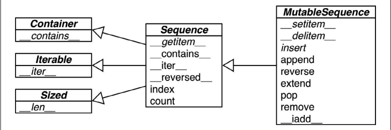

## 1、[python 特殊方法](https://docs.python.org/3/reference/datamodel.html)

**跟运算符无关的特殊方法**

| 类别             | 方法名                                                                             |
|:---------------|:--------------------------------------------------------------------------------|
| 字符串 / 字节序列表示形式 | `__repr__`、`__str__`、`__format__`、`__bytes__`                                   |
| 数值转换           | `__abs__`、`__bool__`、`__complex__`、`__int__`、`__float__`、`__hash__`、`__index__` |
| 集合模拟           | `__len__`、`__getitem__`、`__setitem__`、`__delitem__`、`__contains__`              |
| 迭代枚举           | `__iter__`、`__reversed__`、`__next__`                                            |
| 可调用模拟          | `__call__`                                                                      |
| 上下文管理          | `__enter__`、`__exit__`                                                          |
| 实例创建和销毁        | `__new__`、`__init__`、`__del__`                                                  |
| 属性管理           | `__getattr__`、`__getattribute__`、`__setattr__`、`__delattr__`、`__dir__`          |
| 属性描述符          | `__get__`、`__set__`、`__delete__`                                                |
| 跟类相关的服务        | `__prepare__`、`__instancecheck__`、`__subclasscheck__`                           |

**跟运算符相关的特殊方法**

| 类别        | 方法名和对应的运算符                                                                                                                                       |
|:----------|:-------------------------------------------------------------------------------------------------------------------------------------------------|
| 一元运算符     | `__neg__ -`、`__pos__ +`、`__abs__ abs()`                                                                                                          |
| 众多比较运算符   | `__lt__ <`、`__le__ <=`、`__eq__ ==`、`__ne__ !=`、`__gt__ >`、`__ge__ >=`                                                                            |
| 算术运算符     | `__add__ +`、`__sub__ -`、`__mul__ *`、`__truediv__ /`、`__floordiv__ //`、`__mod__ %`、`__divmod__ divmod()`、`__pow__ ** 或 pow()`、`__round__ round()` |
| 反向算术运算符   | `__radd__`、`__rsub__`、`__rmul__`、`__rtruediv__`、`__rfloordiv__`、`__rmod__`、`__rdivmod__`、`__rpow__`                                              |
| 增量赋值算术运算符 | `__iadd__`、`__isub__`、`__imul__`、`__itruediv__`、`__ifloordiv__`、`__imod__`、`__ipow__`                                                            |
| 位运算符      | `__invert__ ~`、`__lshift__ <<`、`__rshift__ >>`、`__and__ &`、`__or__`                                                                              |、`__xor__                                                                     |
| 反向位运算符    | `__rlshift__`、`__rrshift__`、`__rand__`、`__rxor__`、`__ror__`                                                                                      |
| 增量赋值位运算符  | `__ilshift__`、`__irshift__`、`__iand__`、`__ixor__`、`__ior__`                                                                                      |

## 2、数据结构

### 2.1、内置序列类型

容器序列

- list、tuple 和 collections.deque 这些序列能存放不同类型的数据。

扁平序列

- str、bytes、bytearray、memoryview 和 array.array，这类序列只能容纳一种类型。



### 2.2、Python数组的使用

创建数组需要一个类型码，形如 array(‘d’），这个类型码是用来表示在底层实现的 C 语言的数据类型。一般我们用的 Python 底层是用 C
语言编写实现的 ，所以又称为 CPython。

Python 定义了以下这些类型码：

| 类型码 | C 类型               | Python 类型  | 所占字节 |
|:----|:-------------------|:-----------|:-----|
| ‘b’ | signed char        | int        | 1    |
| ‘B’ | unsigned char      | int        | 1    | 
| ‘u’ | Py_UNICODE         | Unicode 字符 | 2    |    
| ‘h’ | signed short       | int        | 2    |
| ‘H’ | unsigned short     | int        | 2    |
| ‘i’ | signed int         | int        | 2    |
| ‘I’ | unsigned int       | int        | 2    |
| ‘l’ | signed long        | int        | 4    |
| ‘L’ | unsigned long      | int        | 4    |
| ‘q’ | signed long long   | int        | 8    |
| ‘Q’ | unsigned long long | int        | 8    |
| ‘f’ | float              | float      | 4    |
| ‘d’ | double             | float      | 8    |

'u' 类型码对应于 Python 中已过时的 unicode 字符 (Py_UNICODE 即 wchar_t)。 根据系统平台的不同，它可能是 16 位或 32
位。

比如 b 类型码表示的是有符号字符（ signed char ），array('b')创建出的数组就只能存放一个字节大小的整数，范围从 -128 到 127
。通过这样的限制，即使序列很长，拥有很多数字，也能节省空间。

**数组定义好类型，就不能存放非定义类型的数据。**

## 2、异常结构
```markdown
BaseException
 ├── BaseExceptionGroup
 ├── GeneratorExit
 ├── KeyboardInterrupt
 ├── SystemExit
 └── Exception
      ├── ArithmeticError
      │    ├── FloatingPointError
      │    ├── OverflowError
      │    └── ZeroDivisionError
      ├── AssertionError
      ├── AttributeError
      ├── BufferError
      ├── EOFError
      ├── ExceptionGroup [BaseExceptionGroup]
      ├── ImportError
      │    └── ModuleNotFoundError
      ├── LookupError
      │    ├── IndexError
      │    └── KeyError
      ├── MemoryError
      ├── NameError
      │    └── UnboundLocalError
      ├── OSError
      │    ├── BlockingIOError
      │    ├── ChildProcessError
      │    ├── ConnectionError
      │    │    ├── BrokenPipeError
      │    │    ├── ConnectionAbortedError
      │    │    ├── ConnectionRefusedError
      │    │    └── ConnectionResetError
      │    ├── FileExistsError
      │    ├── FileNotFoundError
      │    ├── InterruptedError
      │    ├── IsADirectoryError
      │    ├── NotADirectoryError
      │    ├── PermissionError
      │    ├── ProcessLookupError
      │    └── TimeoutError
      ├── ReferenceError
      ├── RuntimeError
      │    ├── NotImplementedError
      │    └── RecursionError
      ├── StopAsyncIteration
      ├── StopIteration
      ├── SyntaxError
      │    └── IndentationError
      │         └── TabError
      ├── SystemError
      ├── TypeError
      ├── ValueError
      │    └── UnicodeError
      │         ├── UnicodeDecodeError
      │         ├── UnicodeEncodeError
      │         └── UnicodeTranslateError
      └── Warning
           ├── BytesWarning
           ├── DeprecationWarning
           ├── EncodingWarning
           ├── FutureWarning
           ├── ImportWarning
           ├── PendingDeprecationWarning
           ├── ResourceWarning
           ├── RuntimeWarning
           ├── SyntaxWarning
           ├── UnicodeWarning
           └── UserWarning
```

## 3、标准库中的生成器函数
### 3.1、用于过滤的生成器函数
第一组是用于过滤的生成器函数：从输入的可迭代对象中产出元素的子集，而且不修改元
素本身

| 模块        | 函数                                                 | 说明                                                                                      |
|-----------|----------------------------------------------------|-----------------------------------------------------------------------------------------|
| itertools | compress(it, selector_it)                          | 并行处理两个可迭代的对象；如 selector_it 中的元素是 真值，产出 it 中对应的元素                                        |
| itertools | dropwhile(predicate, it)                           | 处理 it，跳过 predicate 的计算结果为真值的元素，然后 产出剩下的各个元素（不再进一步检查）                                    |
| （内置）      | filter(predicate, it)                              | 把 it 中的各个元素传给 predicate，如果 predicate(item) 返回真值，那么产出对应的元素；如果 predicate 是 None，那么只产出真值元素 |
| itertools | filterfalse(predicate, it)                         | 与 filter 函数的作用类似，不过 predicate 的逻辑是相反的：predicate 返回假值时产出对应的元素                            |
| itertools | islice(it, stop) 或 islice(it, start, stop, step=1) | 产出 it 的切片，作用类似于 s[:stop] 或 s[start:stop:step]， 不过 it 可以是任何可迭代的对象，而且这个函数实现的是惰 性操作        |
| itertools | takewhile(predicate, it)                           | predicate 返回真值时产出对应的元素，然后立即停止，不 再继续检查                                                   |
### 3.2、用于映射的生成器函数

| 模块        | 函数                              | 说明                                                                           |
|-----------|---------------------------------|------------------------------------------------------------------------------|
| itertools | accumulate(it, [func])          | 产出累积的总和；如果提供了 func，那么把前两个元素传给它，然后把计算结果和下一个元素传给它，以此类推， 最后产出结果                 |
| （内置）      | enumerate(iterable, start=0)    | 产出由两个元素组成的元组，结构是 (index, item)，其中 index 从 start 开始计数，item 则从 iterable 中获取    |
| （内置）      | map(func, it1, [it2, ..., itN]) | 把 it 中的各个元素传给 func，产出结果；如果传入 N 个可 迭代的对象，那么 func 必须能接受 N 个参数，而且要并行 处理各个可迭代的对象 |
| itertools | starmap(func, it)               | 把 it 中的各个元素传给 func，产出结果；输入的可迭代对 象应该产出可迭代的元素 iit，然后以 func(*iit) 这种形 式调用 func  |

### 3.3、合并多个可迭代对象的生成器函数

| 模块        | 函数                                         | 说明                                                                                |
|-----------|--------------------------------------------|-----------------------------------------------------------------------------------|
| itertools | chain(it1, ..., itN)                       | 先产出 it1 中的所有元素，然后产出 it2 中的所有元素，以此类 推，无缝连接在一起                                      |
| itertools | chain.from_iterable(it)                    | 产出 it 生成的各个可迭代对象中的元素，一个接一个，无缝连接 在一起；it 应该产出可迭代的元素，例如可迭代的对象列表                      |
| itertools | product(it1, ..., itN, repeat=1)           | 计算笛卡儿积：从输入的各个可迭代对象中获取元素，合并成由 N 个元素组成的元组，与嵌套的 for 循环效果一样；repeat 指明重复 处理多少次输入的可迭代对象 |
| （内置）      | zip(it1, ..., itN)                         | 并行从输入的各个可迭代对象中获取元素，产出由 N 个元素组成 的元组，只要有一个可迭代的对象到头了，就默默地停止                          |
| itertools | zip_longest(it1, ..., itN, fillvalue=None) | itertools 并行从输入的各个可迭代对象中获取元素，产出由 N 个元素组 成的元组，等到最长的可迭代对象到头后才停止，空缺的值使用fillvalue 填充  |


### 3.4、把输入的各个元素扩展成多个输出元素的生成器函数

| 模块        | 函数                             | 说明                                                              |
|-----------|--------------------------------|-----------------------------------------------------------------|
| itertools | combinations(it, out_len)      | 把 it 产出的 out_len 个元素组合在一起，然后产出 itertools combinations_with_re   |
| itertools | placement(it, out_len)         | 把 it 产出的 out_len 个元素组合在一起，然后产出，包含相同元素的组合                        |
| itertools | count(start=0, step=1)         | 从 start 开始不断产出数字，按 step 指定的步幅增加                                 |
| itertools | cycle(it)                      | 从 it 中产出各个元素，存储各个元素的副本，然后按顺序重复不断地产出各个元素                         |
| itertools | permutations(it, out_len=None) | 把 out_len 个 it 产出的元素排列在一起，然后产出这些排列；out_len 的默认值等于 len(list(it)) |
| itertools | repeat(item, [times])          | 重复不断地产出指定的元素，除非提供 times，指定次数                                    |

### 3.5、用于重新排列元素的生成器函数

| 模块        | 函数                    | 说明                                                                |
|-----------|-----------------------|-------------------------------------------------------------------|
| itertools | groupby(it, key=None) | 产出由两个元素组成的元素，形式为 (key, group)，其中 key 是分组标准， group 是生成器，用于产出分组里的元素 |
| （内置）      | reversed(seq)         | 从后向前，倒序产出seq中的元素；seq必须是序列，或者是实 现了__reversed__ 特殊方法的对象             |
| itertools | tee(it, n=2)          | 产出一个由 n 个生成器组成的元组，每个生成器用于单独产出输入的可迭代对象中的元素                         |

### 3.6、可迭代的归约函数

| 模块        | 函数                         | 说明                                                                        |
|-----------|----------------------------|---------------------------------------------------------------------------|
| （内置）      | all(it)                    | it 中的所有元素都为真值时返回 True，否则返回 False；all([]) 返回 True                          |
| （内置）      | any(it)                    | 只要 it 中有元素为真值就返回 True，否则返回 False；any([]) 返回False                          |
| （内置）      | max(it, [key=,][default=]) | 返回 it 中值最大的元素；key 是排序函数，与 sorted 函数中的一样； 如果可迭代的对象为空，返回 default            |
| （内置）      | min(it, [key=,][default=]) | 返回 it 中值最小的元素；key 是排序函数，与 sorted 函数中的一样； 如果可迭代的对象为空，返回 default            |
| functools | reduce(func, it,[initial]) | 把前两个元素传给 func，然后把计算结果和第三个元素传给 func，以此类推，返回最后的结果；如果提供了 initial，把它当作第一个元素传入 |
| （内置）      | sum(it, start=0)           | it 中所有元素的总和，如果提供可选的 start，会把它加上（计算浮点数的加法时，可以使用 math.fsum 函数提高精度）          |